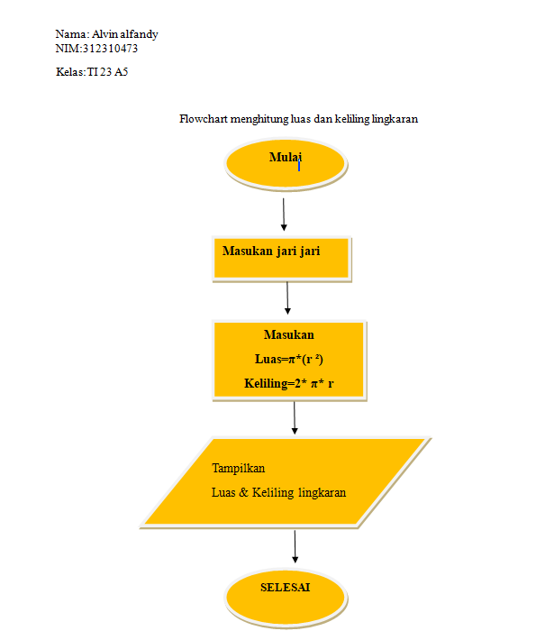

# Praktikum 1

## Flowchartnya 



## menghitung luas dan keliling lingkaran menggunakan Python

* Membuat kode program untuk
menghitung luas dan keliling
lingkaran

```
jarijari = float(input("Masukkan jari-jari lingkaran: ")) 
# kode meminta pengguna untuk menginputkan jari jari

luaslingkaran = 3.14 * jarijari**2  
# kode rumus luas lingkaran

kelilinglingkaran = 2 * 3.14 * jarijari 
# kode rumus keliling lingkaran

print("Luas lingkaran adalah: ", luaslingkaran)
# kode untuk menampilkan hasil luas lingkaran

print("Keliling lingkaran adalah: ", kelilinglingkaran)
# kode untuk menampilkan hasil keliling lingkaran
```
## Maka hasilnya


